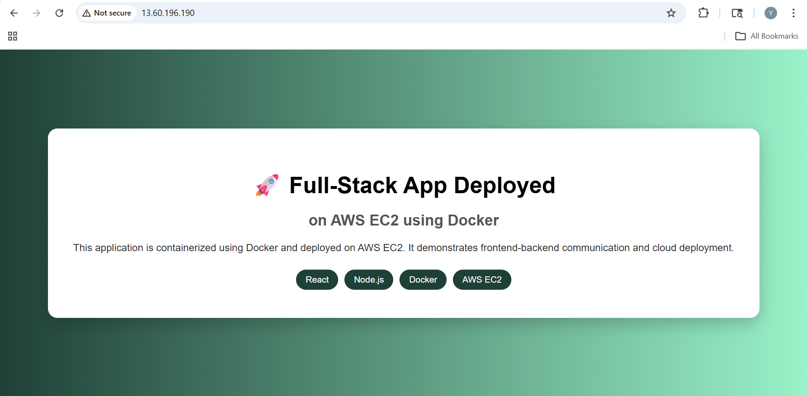

# Full-Stack App Deployment on AWS EC2 using Docker

This project demonstrates deploying a full-stack React + Node.js app in Docker containers on AWS EC2, using Nginx as a reverse proxy for frontend-backend communication.

## Project Overview

- **Frontend:** React.js
- **Backend:** Node.js / Express
- **Containerization:** Docker
- **Web Server / Reverse Proxy:** Nginx
- **Cloud Deployment:** AWS EC2

The frontend and backend are deployed in separate Docker containers. Nginx routes traffic to the frontend on `/` and the backend API on `/api/`.

## Project Structure

project-root/
├── backend/          # Node.js backend Dockerfile + source code
├── frontend/         # React frontend Dockerfile + source code
├── nginx/            # Nginx configuration (default.conf)
├── docker-compose.yml # Multi-container setup for local or EC2 deployment
├── .dockerignore     # Optional ignore rules
└── README.md

## Features

- Fully containerized full-stack application
- Frontend communicates with backend through Nginx reverse proxy
- Deployed on AWS EC2 using Docker
- Demonstrates cloud deployment workflow
- Nginx routes frontend at `/` and backend API at `/api/`.
- Demonstrates building Docker images and pushing to Docker Hub.
- Shows multi-container orchestration using docker-compose.

## Deployment Workflow

1. Clone the GitHub repository to local machine.
2. Build Docker images for frontend and backend.
3. Push images to Docker Hub.
4. SSH into AWS EC2 instance and pull images.
5. Deploy containers with Docker Compose.
6. Configure Nginx as reverse proxy for frontend and backend.
7. Verify deployment via EC2 public IP.

## Access

Open a web browser and navigate to your EC2 public IP:
http://<EC2_PUBLIC_IP>

You should see the frontend application, and any API requests to `/api/` will be routed to the backend container.

## Technologies Used

- React.js
- Node.js / Express
- Docker
- Nginx
- AWS EC2

## Notes

- Implemented Docker-based multi-container architecture for full-stack application.
- Configured Nginx as reverse proxy to route traffic between frontend and backend.
- Deployed containers on AWS EC2 and configured security groups for public access.
- Demonstrated cloud deployment workflow and Docker networking best practices.
- Managed source code versioning with Git and GitHub.mmunication.
- The project demonstrates containerization, reverse proxy setup, and cloud deployment best practices.

- ## Screenshot
- 
